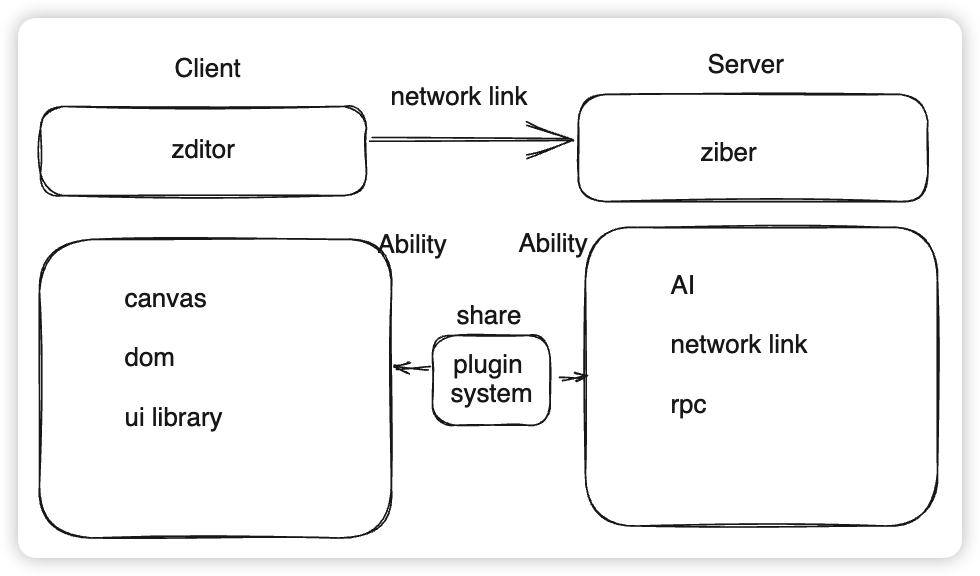

# zim

zim is `z` and `vim`.

`z` is the last of alphabet, and never be the hot word.

`vim` is a life style.

We usually use different tools to manage our life, we often change between about them, we ofter make choice, make choice is expensive.

## reduce4

we, zimer, comes from an organization named reduce4.

this organization has defined a life style of simple.

zim is an try make reduce4's best ideas to the world.

## architecture

- react
  - zim application layer
- slate.js
  - zim kernal
- leafer.js
  - zim canvas render backend
- coc.nvim
  - zim lsp complete
- pnpm(workspace)
  - monorepo
- zps
  - zim plugin system
- vscode remote
  - zim backend design
- ant design
  - zui design goal

### architecture graph

#### v1



## development

### zui

zui is the ui library for zim.

```sh
pnpm run ui
```
